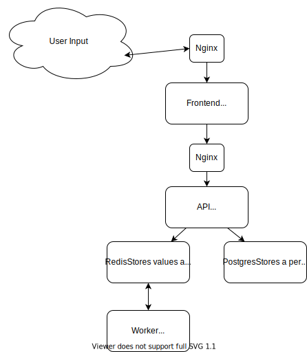

## This project is based on Docker & Kubernetes: The Complete Guide by Stephen Grider

[Link to Course](https://www.udemy.com/share/101WjMBkAfd15QTXQ=/)

### Technologies Implemented:

* Docker
* Nginx
* NodeJS
* React
* Postgres
* Redis

### Architecture:

